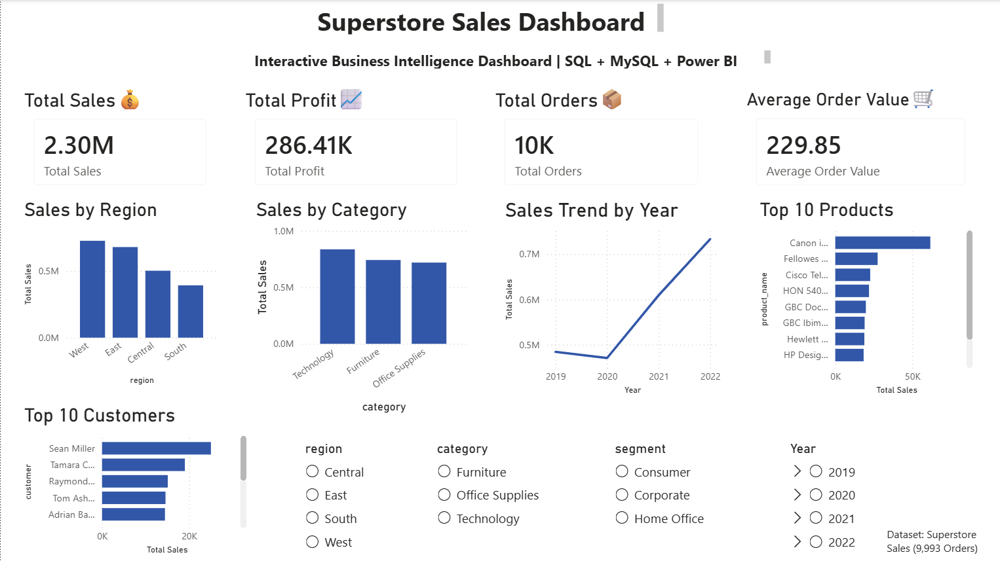

# 📊 Superstore Sales Dashboard

An interactive Business Intelligence dashboard built using **MySQL**, **SQL**, and **Power BI** to analyze Superstore sales performance. This project demonstrates the complete analytics workflow from data storage and SQL querying to interactive dashboard creation.

---

## 🚀 Features

* Import and manage sales data using MySQL
* Perform data analysis with SQL queries
* Interactive Power BI dashboard
* KPI Cards:

  * Total Sales
  * Total Profit
  * Total Orders
  * Average Order Value
* Visualizations:

  * Sales by Region
  * Sales by Category
  * Sales Trend by Year
  * Top 10 Products
  * Top 10 Customers
* Interactive slicers for:

  * Region
  * Category
  * Segment
  * Year

---

## 🛠️ Technologies Used

* MySQL 8.0
* SQL
* Power BI Desktop

---

## 📁 Project Structure

```
Superstore-Sales-Dashboard/
│
├── Dashboard.pbix
├── superstore_queries.sql
├── cleaned_sales_dataSet.csv
├── dashboard.png
└── README.md
```

---

## 📷 Dashboard Preview



---

## 📌 Key Insights

* Technology is the highest-performing product category.
* The West region generated the highest sales.
* Sales increased significantly in 2022.
* The dashboard enables dynamic filtering by region, category, segment, and year.

---

## 📈 Skills Demonstrated

* Database Design
* SQL Querying
* Data Import & Management
* Data Analysis
* Business Intelligence
* Dashboard Design
* Data Visualization

---

## 👨‍💻 Author

**Adithya Madhupal**

Feel free to explore the project and provide feedback!
